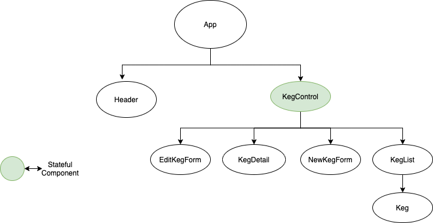

# Jean Claude Van Damme's Taproom
<div align="center">

</div>

### A React website by David Sterry 
Initialized on 02/12/21
Last updated on 02/12/21

## 📖  Description
Jean Claude Van Damme has launched a new Belegian Beer Tap room in Portland. He needed a website to help keep track of his kegs. This site lets him create, update, delete kegs, as well as keep track of how many beers are in an individual keg. 

## **User Stories**
* Jean Claude should be able to Create, Read, Update, and Delete Kegs for his tap room
* Jean Claude should be able to decrease the quantity of beer in an individual keg as he pours beers for customers. 
* When a keg reaches 0, indicating there are no more beers left it should say "The Keg is empty" And Jean Claude should not be able to reduce the amount of beers in the keg below 0

## **Stretch Goals
* Custom styling. Jean Claude really wants this site to reflect his former career

## 🔧 Setup & Requirements
### 📋 Necessary Specifications
 * An internet browser of your choice. I prefer Chrome
 * A code editor of your choice. I use VSCode downloaded it [here](https://code.visualstudio.com/)
 *  **Node.js :** You can check if you have Node.js by running `node -v` in the command line. If you do not have Node.js please find more information and download [here](https://nodejs.org/en/)
 * you can also install node through Homebrew by running `brew install node` in the command line.
* **Jest :** If your testing does not run, you may need to install Jest, you can do this by running `npm install jest@24.9.0 --save-dev` in the command line.

## **How to get this project** 

### Download from Github:
1. Use the browser navigate to my GitHub page [respository](https://github.com/Dave-Sterry/Tap-Room-Redux)
2. Click the Green **Code** button and select **Download Zip**

### Alternatively clone from Github via Gitbash:
1. In your terminal, navigate to the folder where you would like to clone the project too
2. Clone this repo to your chosen folder using "git clone https://github.com/Dave-Sterry/Tap-Room-Redux in terminal

### 🧰  Setup Options

1. Open the project in your code editor of choice 
2. In the Terminal navigate to the project folder in this case Tap-Room
3. Run ```npm install``` to install required dependencies 
4. Run ```npm start``` This will run the app in the development mode.
5. Open [http://localhost:3000](http://localhost:3000) to view it in the browser.
#### `npm test`

This allows you to test the applications action creators and reducers.

#### `npm run build`

Builds the app for production to the `build` folder.\
It correctly bundles React in production mode and optimizes the build for the best performance.

The build is minified and the filenames include the hashes.\
Your app is ready to be deployed!

The page will reload if you make edits.\
You will also see any lint errors in the console.

### How to use the site. 
1. Click the "Add a Keg" button 
2. Enter in values for the required fields. 
3. "return to list" will let you see all kegs you've added
4. Clicking on a single keg will let you see it's details
5. On the Details page you can Delete, Update, or sell individual beers from the keg

### Project Planning Documentation 





# Getting Started with Create React App

This project was bootstrapped with [Create React App](https://github.com/facebook/create-react-app).

## 🐛 Known Bugs
There are no known bugs

## 🛠️ Technologies Used

* React Framework v17.0
* Javascript ES6
* JSX
* Git & GitHub
* Babel
* ESLint
* CSS
* HMTL
* Bootstrap
* node.js
* VSCode
* created using ```create-react-app```
* Redux 


## 📫 Support and contact details
Authored by: David Sterry
If you have any issues during installation please follow the set up instructions again. Contact me at sterry.david@gmail.com in regards to this project

## **License**

This project is licensed under **MIT 2.0**
Permission is hereby granted, free of charge, to any person obtaining a copy
of this software and associated documentation files (the "Software"), to deal
in the Software without restriction, including without limitation the rights
to use, copy, modify, merge, publish, distribute, sublicense, and/or sell
copies of the Software, and to permit persons to whom the Software is
furnished to do so, subject to the following conditions:

The above copyright notice and this permission notice shall be included in all
copies or substantial portions of the Software.

THE SOFTWARE IS PROVIDED "AS IS", WITHOUT WARRANTY OF ANY KIND, EXPRESS OR
IMPLIED, INCLUDING BUT NOT LIMITED TO THE WARRANTIES OF MERCHANTABILITY,
FITNESS FOR A PARTICULAR PURPOSE AND NONINFRINGEMENT. IN NO EVENT SHALL THE
AUTHORS OR COPYRIGHT HOLDERS BE LIABLE FOR ANY CLAIM, DAMAGES OR OTHER
LIABILITY, WHETHER IN AN ACTION OF CONTRACT, TORT OR OTHERWISE, ARISING FROM,
OUT OF OR IN CONNECTION WITH THE SOFTWARE OR THE USE OR OTHER DEALINGS IN THE
SOFTWARE.

Copyright © 2020 David Sterry

